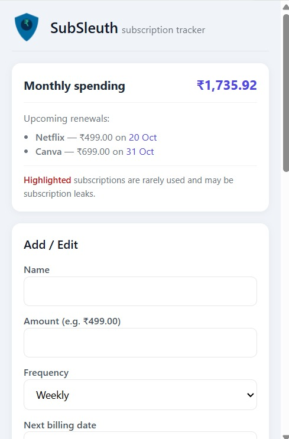
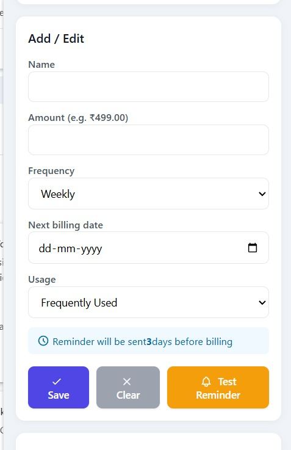

# 🕵️‍♂️ SubSleuth – Smart Subscription Tracker

**SubSleuth** is a Chrome extension that helps you stay on top of your online subscriptions — track renewals, control spending, and get reminders before you’re charged again 💳  

---

## 🚀 Features
- 💡 Track all active subscriptions easily  
- 🔔 Get reminders 3 days before your next billing date  
- 💰 View total monthly spending at a glance  
- 🧾 Highlight rarely used subscriptions (potential “leaks”)  
- 🛡 Privacy-first: all data stored locally using `chrome.storage.local`

---

## 🧠 Tech Stack
- **Chrome Manifest V3**  
- **JavaScript, HTML, CSS**  
- **Chrome Notifications API**  
- **Chrome Alarms API**  
- **chrome.storage.local**

---

## 🖼 Preview

| Dashboard | Add/Edit Subscriptions | Manage Subscriptions |
|------------|------------------------|-----------------------|
|  |  |  |

*(You can replace the image names and paths after uploading screenshots in a `screenshots/` folder.)*

---

## 🛠 Installation Guide

1. **Clone this repository**
   ```bash
   git clone https://github.com/ka0913560-hub/SubSleuth.git
